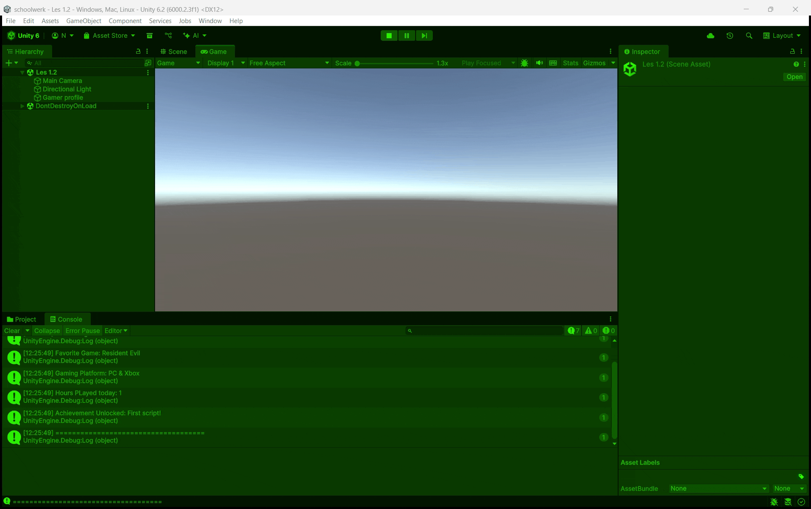
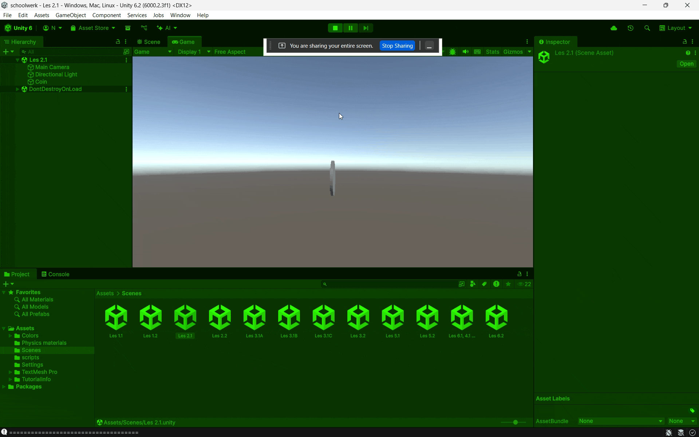
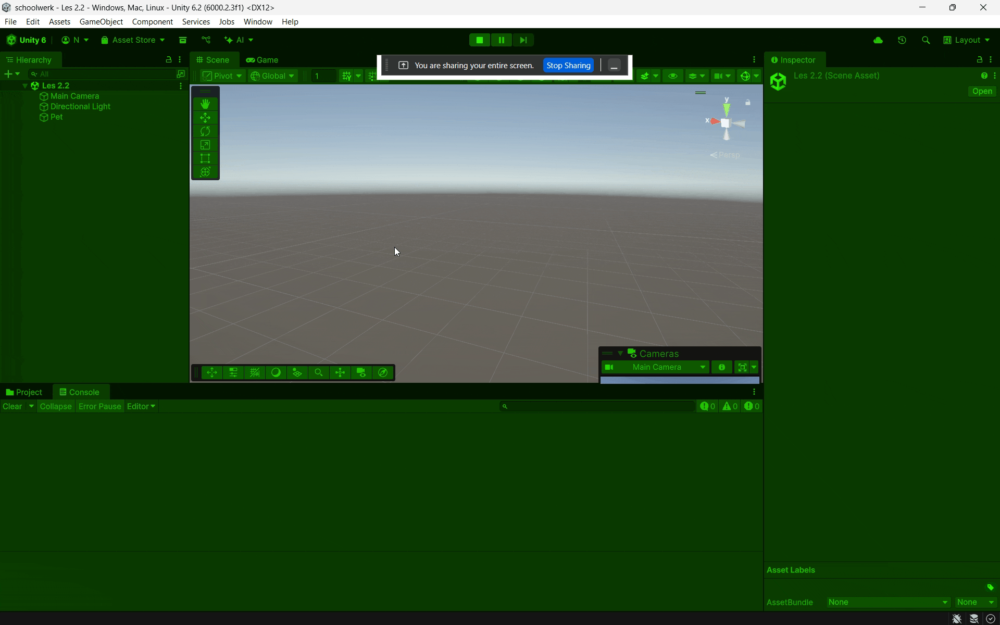
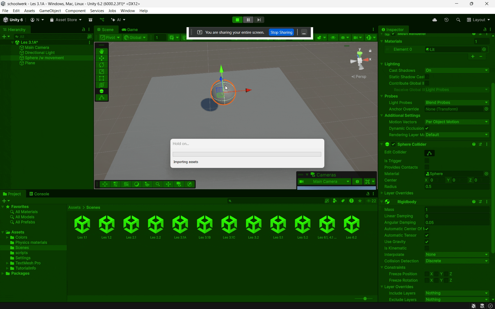
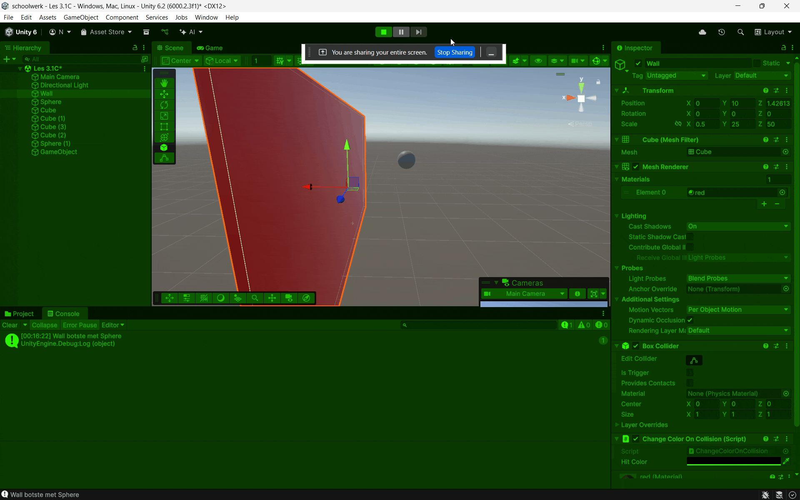
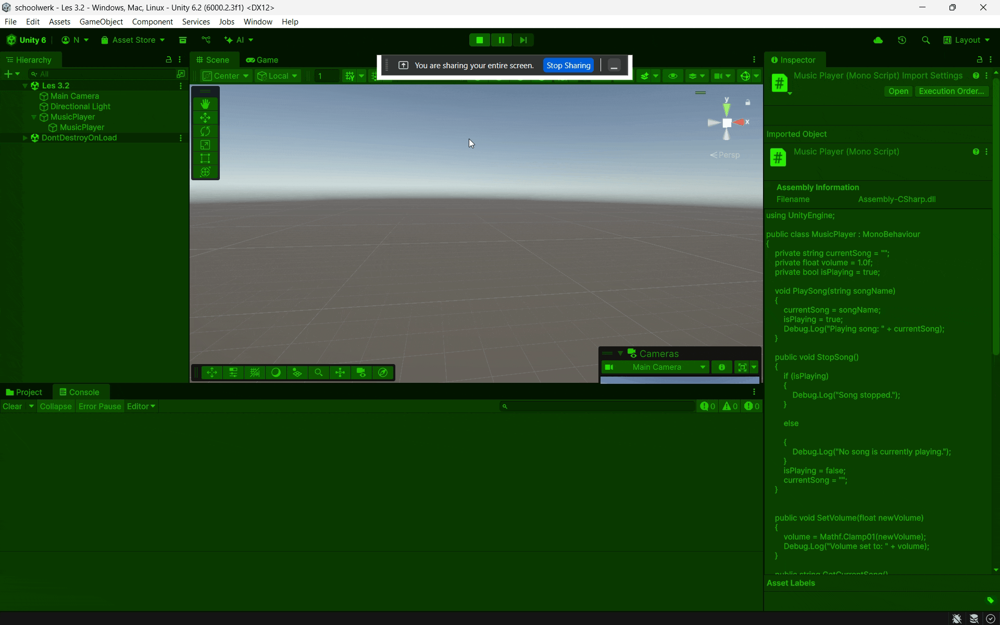
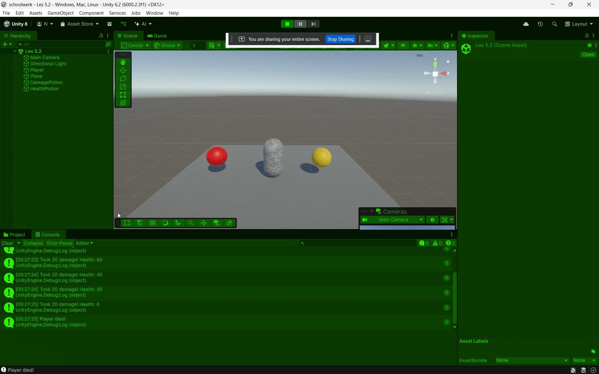

# M1GDV
Module 1 Game Developement

# Les 1.1

## Primitive Building Challenge
Ik heb een basic huisje gemaakt met een paar bomen erbij met de 3d shapes van Unity

# Les 1.2

[Script](https://github.com/naokimon/m1gdv/blob/main/Opdrachten/Scripts/Gamer%20profile.cs)

## Personal Gaming Profile Generator
Ik heb een gaming profile gemaakt door gebruik te maken van debug.log
[Script](https://github.com/naokimon/m1gdv/blob/main/Opdrachten/Scripts/Gamer%20profile.cs)

# Les 2.1

## Draaiende Muntje
Ik heb een draaiende munt gemaakt in Unity met een script waarbij ik gebruik van de transform functie en time delta
[Script](https://github.com/naokimon/m1gdv/blob/main/Opdrachten/Scripts/Draaiende%20muntje.cs)

# Les 2.2

## Virtual Pet Basics
Ik heb een simpele tamagotchi achtige pet gemaakt in de console door gebruik te maken van if statements en input get key down
[Script](https://github.com/naokimon/m1gdv/blob/main/Opdrachten/Scripts/Pet.cs)

# Les 3.1
## Vallende bal met stuiter

Ik heb een vallende bal met stuiter gemaakt door gebruik te maken van basic shapes waar collider components opzitten. Ook heb ik de bonus opdracht gedaan waar ik de plane stuiter geef zodat het een soort trampoline vloer wordt.

## Foutieve physics verkennen

Ik heb de opdracht uitgevoerd waaruit te vinden is dat als de gravity op 0 is dat er dan geen stop komt aan hoe hoog de bal gaat ook slipt de bal.

## Velocity, botsing en trigger-event

Ik heb de ballshooter.cs overgenomen van de opdracht en daaruit heb ik zelf ook nog een script gemaakt waardoor bij een oncollisionenter de kleur van de muur verandert
[Script](https://github.com/naokimon/m1gdv/blob/main/Opdrachten/Scripts/ChangeColorOnCollision.cs)

# Les 3.2

## Muziek Speler Functies
Ik heb een muziek speler gemaakt in console door gebruik te maken van debug.log en inputgetkeydowns
[Script](https://github.com/naokimon/m1gdv/blob/main/Opdrachten/Scripts/MusicPlayer.cs)

# Les 4.1

## Coin Collector
Ik heb een coin collector gemaakt en ik heb het toegevoegd aan mijn game uit les 6.1 omdat ik erbij wou aan toevoegen.
[Script 1](https://github.com/naokimon/m1gdv/blob/main/Opdrachten/Scripts/Movement.cs)
[Script 2](https://github.com/naokimon/m1gdv/blob/main/Opdrachten/Scripts/CoinCollecting.cs)

# Les 4.2

## Coin Pickup System
Ik heb een coin pickup system toegevoegd aan mijn game uit les 6.1. Hierbij heb ik gebruikt gemaakt van van de debug log om het te laten zien in de console.
[Script 1](https://github.com/naokimon/m1gdv/blob/main/Opdrachten/Scripts/CoinPickup.cs)
[Script 2](https://github.com/naokimon/m1gdv/blob/main/Opdrachten/Scripts/CoinCollecting.cs)

# Les 5.1

## Health Status Indicator
Ik heb een health status indicator gemaakt door gebruik te maken van if statements.
[Script](https://github.com/naokimon/m1gdv/blob/main/Opdrachten/Scripts/Playerhealth2.cs)

# Les 5.2

## Slimme Pickup System
Ik heb een slimme pickup system gemaakt door gebruik van triggers. Ik heb een health potion gemaakt en een damage potion die ik simpel heb verandert door midel van += te veranderen naar -=.
[Script 1](https://github.com/naokimon/m1gdv/blob/main/Opdrachten/Scripts/Movement.cs)
[Script 2](https://github.com/naokimon/m1gdv/blob/main/Opdrachten/Scripts/HealthPickup.cs)
[Script 3](https://github.com/naokimon/m1gdv/blob/main/Opdrachten/Scripts/DamagePickup.cs)

# Les 6.1

## Bouw je eigen mini-level
Ik heb mijn eigen mini-level gemaakt. Ik heb een platformer gemaakt met een paar coins verspreid. Je speelt als rood blokje die springt van platform tot platform. Je beweegt met A en D en springt met SPACE. Als je een platform mist respawn je terug op je begin plek.
[Script 1](https://github.com/naokimon/m1gdv/blob/main/Opdrachten/Scripts/Movement.cs)
[Script 2](https://github.com/naokimon/m1gdv/blob/main/Opdrachten/Scripts/Respawn.cs)
[Script 3](https://github.com/naokimon/m1gdv/blob/main/Opdrachten/Scripts/Draaiende%20muntje.cs)
[Script 4](https://github.com/naokimon/m1gdv/blob/main/Opdrachten/Scripts/CoinCollecting.cs)
[Script 5](https://github.com/naokimon/m1gdv/blob/main/Opdrachten/Scripts/CoinPickup.cs)

